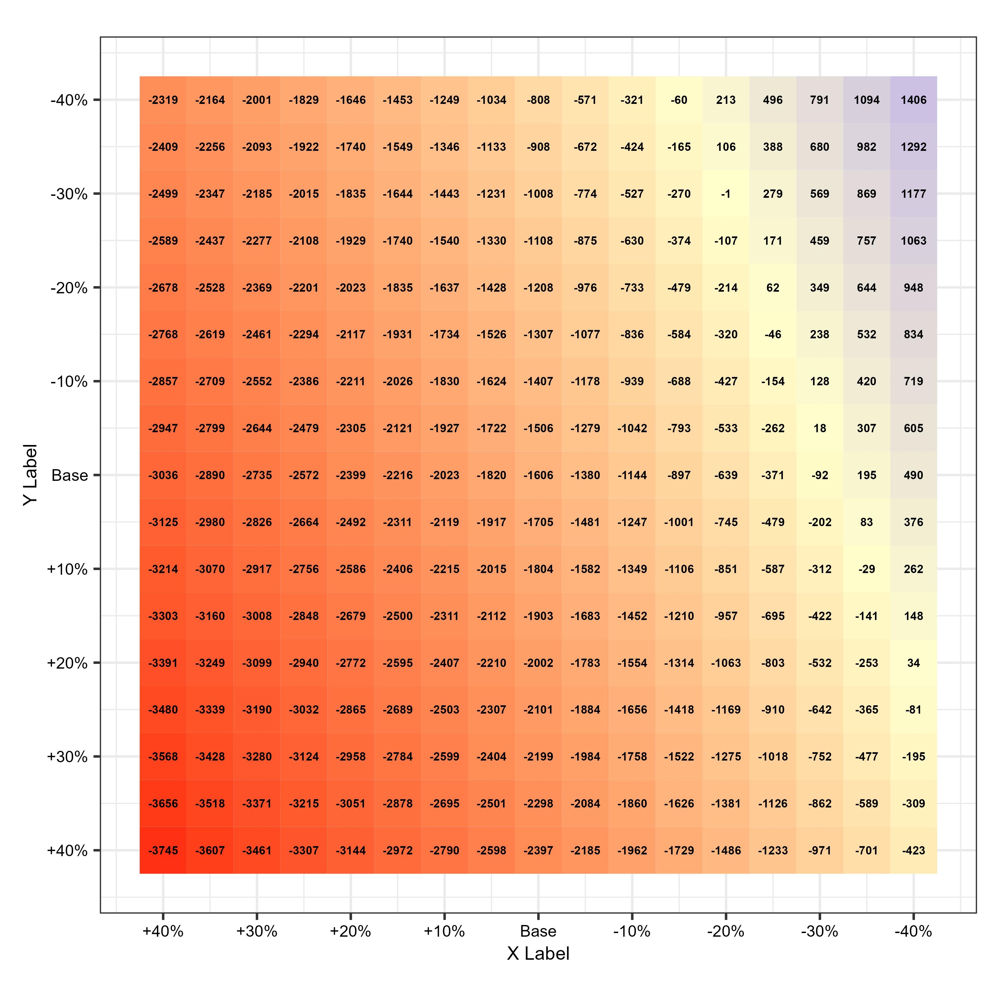

# Heatmap two-way sensitivity analysis plot

# Notes

This plot was designed to visualize the results of a two-way sensitivity analysis in simulation modeling. The plot shows the results as a heatmap, with the x-axis representing the values of one parameter and the y-axis representing the values of another parameter. The color of each cell in the heatmap represents the value of the outcome variable at the corresponding combination of parameter values.

