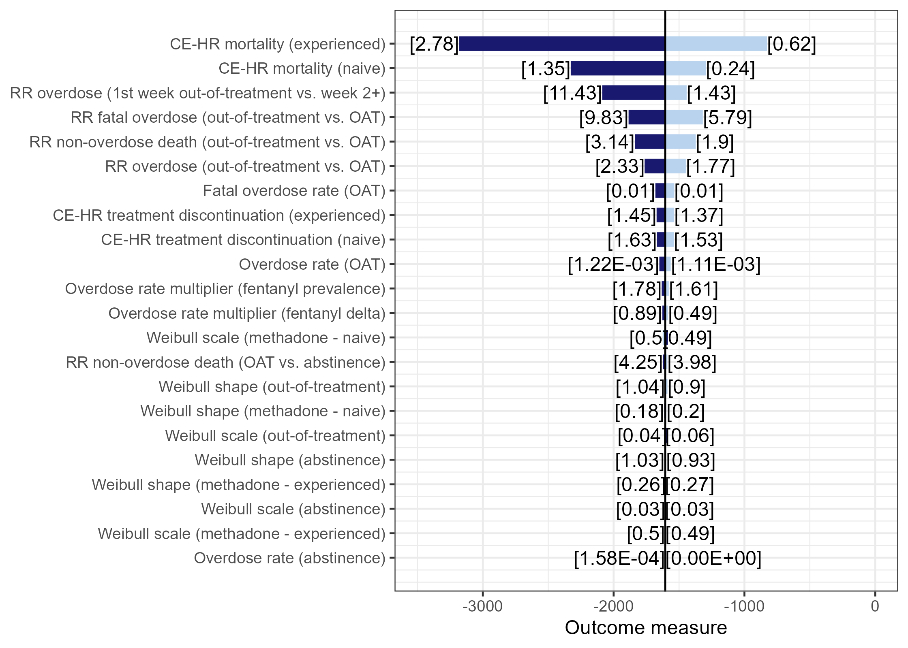

# Heatmap two-way sensitivity analysis plot

# Notes

This plot was designed to visualize the results of deterministic univariate sensitivity analysis in simulation modeling. It displays results in a tornado plot, with the y-axis representing different parameters, and the x-axis representing the impact of each parameter on the outcome variable when varied between a range of values. The length of each bar in the tornado plot represents the magnitude of the impact of the corresponding parameter on the outcome variable. The bars are sorted in descending order of impact, with the most impactful parameter at the top of the plot.

